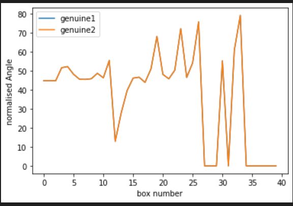

  
 
 

# Offline Signature Verification System

## **Introduction**
This project implements an **Offline Signature Verification System** using Artificial Intelligence techniques. It employs image processing, feature extraction, and machine learning algorithms to differentiate between genuine and forged signatures. The system utilizes Gabor filters for feature generation and applies dimensionality reduction with PCA to train the model for high accuracy

---

## 🎯**Objectives**

1. Develop an AI-based solution to verify offline signatures with high accuracy.
2. Extract and analyze features to differentiate genuine signatures from skilled forgeries.
3. Employ supervised learning techniques to enhance the classification process.
4. Provide a scalable and efficient verification model for offline signature-based authentication.

---

## 🚀**Features**
1.**Image Preprocessing**: Signatures are resized, normalized, and rotated for uniform processing.

2.**Feature Extraction**: Gabor filter banks capture directional features, and angles of stroke are analyzed box-wise.

3.**Dimensionality Reduction**: PCA reduces the feature space while retaining significant information.

4.**Classification**: The system uses K-Nearest Neighbors (KNN) to classify signatures as genuine or forged.

5.**Visualization**: Visual comparisons of feature vectors and normalized angles are provided for better understanding.

---

## 🏗️**Workflow**
### 1.Dataset Preparation:
- Collect genuine and forged signature images.
- Preprocess images (rotation, resizing, normalization).
### 2.Feature Extraction:
- Use Gabor filters to extract directional features.
- Compute angle-based feature vectors for each signature.
### 3.Dimensionality Reduction:
- Apply PCA for transforming features into a reduced feature space.
### 4.Classification:
- Train a KNN classifier with extracted features.
- Classify input signatures based on feature discrepancies.
### 5.Evaluation:
- Measure accuracy using test samples.
- Analyze the distribution of genuine and forged features using Mahalanobis distance.

  

---
## 📊**Observations**

- The system achieved 85% accuracy in distinguishing genuine signatures from skilled forgeries.
- Gabor filters effectively extracted directional features relevant for signature verification.
- PCA significantly reduced computation time while preserving essential feature information.
- Normalized angle plots showed a clear distinction between genuine and forged signature

### Visual Analysis

  
 

---
## **Conclusion**
The Offline Signature Verification System demonstrates a robust approach to signature authentication using advanced AI and image processing techniques. It offers a scalable and efficient solution for verifying offline signatures in real-world applications. Future enhancements could focus on improving accuracy with additional data and more sophisticated classifier.

---
## Achivements
- **InternShip Certification**:  
   The Certificate of IBM SkillsBuild Internship received  after completion of project.  
   📜 [View the Certificate details here](https://drive.google.com/file/d/1u5Vcwc_CzJoBfxeK4H8HnZ-k0ThF_cu8/view?usp=sharing)

